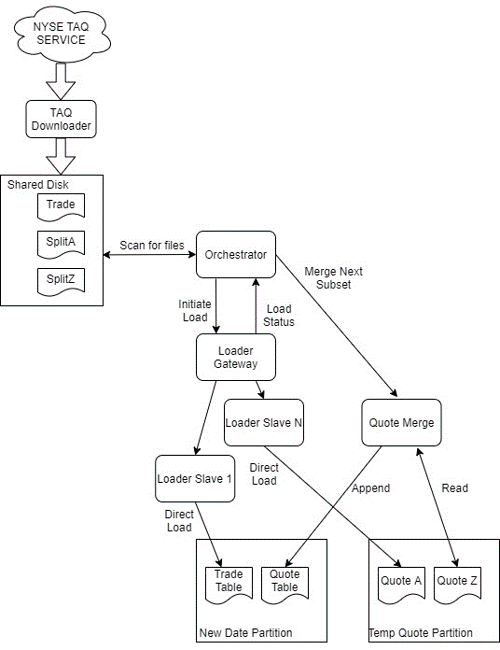

TorQ-TAQ 
========
Torq-TAQ is the name given to the New York Stock Exchange (NYSE) Trade and Quote
(TAQ) Loader built in TorQ. The purpose of this architecture is to efficiently 
grab files containing historical data from the NYSE and load them into kdb. 
TorQ-TAQ currently supports loading three types of files from the NYSE website; 
these files include: trades, national best bid offer (nbbo) and Best Bid Offer 
(quotes). All of the files from the NYSE website are `.gz` files and have the 
structure:

- `EQY_US_ALL_TRADE_YYYYMMDD.gz` *(Trades)* 
- `EQY_US_ALL_NBBO_YYYYMMDD.gz` *(National Best Bid Offer)* 
- `SPLITS_US_ALL_BBO_*_YYYYMMDD.gz` *(Best Bid Offer - 26 files per day)* 

The specification for each of the file types can be found on the NYSE website 
[here.](https://www.nyse.com/publicdocs/nyse/data/Daily_TAQ_Client_Spec_v3.2.pdf)

This documentation will go over a brief summary of the architecture, the 
processes involved, and use cases for the TAQ Loader.

Architecture
============

Processes
=========
The main processes currently involved in TorQ-TAQ are the orchestrator, the 
loader slaves and the merger to merge all 26 quote files for each day.  This
architecture also uses the standard TorQ discovery and gateway processes which
are outlined in the processes section of the TorQ documentation.

## Orchestrator
The orchestrator is responsible for checking when the TAQ data arrives, initiating
loads upon the data's arrival, ensuring data is merged, and moving data to the
proper HDB when all loads are complete.  In addition, the orchestrator is 
in charge of keeping up with various monitoring statistics.  These statistics
include load start times and end times, and indicator if the load was successful,
and error logging for if a process fails.

The Orchestrator requires three parameters to run properly; if these are not 
defined in the config file, they will be supplied with default values.  These
parameters are:

- **optionalparams**: these are additional parameters that you can supply for
the loader function used in TorQ to load data. The dataloader utility documentation
can be found [here.] (https://aquaqanalytics.github.io/TorQ/utilities/#dataloaderq)

- **loadfiles**: this is a list of symbols which allows you to choose which TAQ
files you are interested in. This can be defined in the config file for the 
orchestrator similar to optionalparams. TorQ-TAQ currently supports trade, quote
and nbbo and so this loadfiles variable should only contain these three file types.

- **forceload**: this is a boolean setting which allows you to manually load files
even if they have already been successfully loaded.  This can be used if a file
has been loaded but has been deleted or tampered with in any way.  This setting
may be defined in the config file of the orchestrator or can be overwritten in 
the orchestrator process.

## Loader Gateway
The loader gateway is just a standard TorQ gateway.  TorQ Gateway documentation
can be found [here.](https://aquaqanalytics.github.io/TorQ/Processes/#gateway)

## Loader Slaves
These processes responsible for executing loads. Multiple loader processes exist
to allow loads to run in parallel.

## Quote Merger
The quote merger is the process which will merge all 26 split files as they are
loaded.  Once all split files are successfully loaded and merged, this process
moves all data to the HDB.

